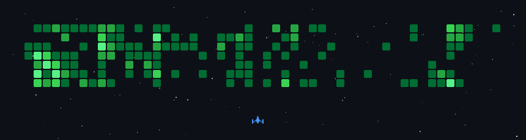

# Agrannya Singh

*Builder. Infrastructure minimalist. Occasional over-engineer.*

## Who I Am

FInal Year CSE undergrad at VIT Vellore. 

I build the parts of a system other people defer. Auth layers, infra pipelines, cloud architecture. The stuff that makes everything else possible and gets blamed when it breaks.

://github.com/Agrannya-Singh)**
Full-stack dashboard for 50,000+ NASA space weather records with real-time visualization. Gemini AI via Genkit generates EDA-aware summaries that actually explain what the data is doing. Built because raw datasets tell you nothing if you cannot read them fast.

## Technical Stack

**Languages**

**Frameworks & Libraries**

**AI / ML**

**Cloud & DevOps**

**Databases**

## GitHub

